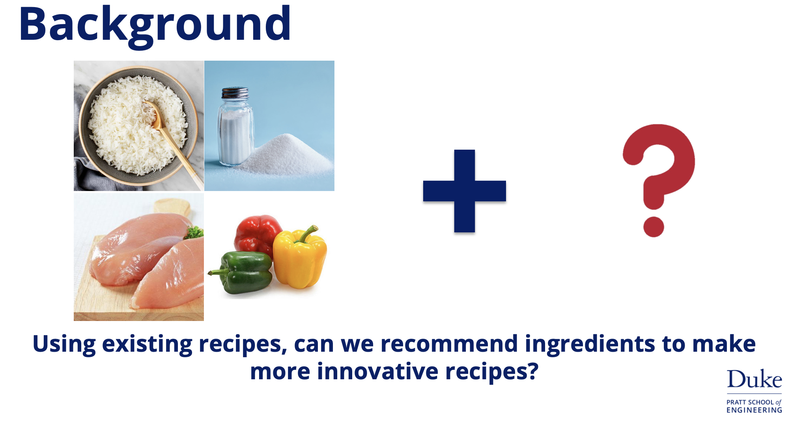
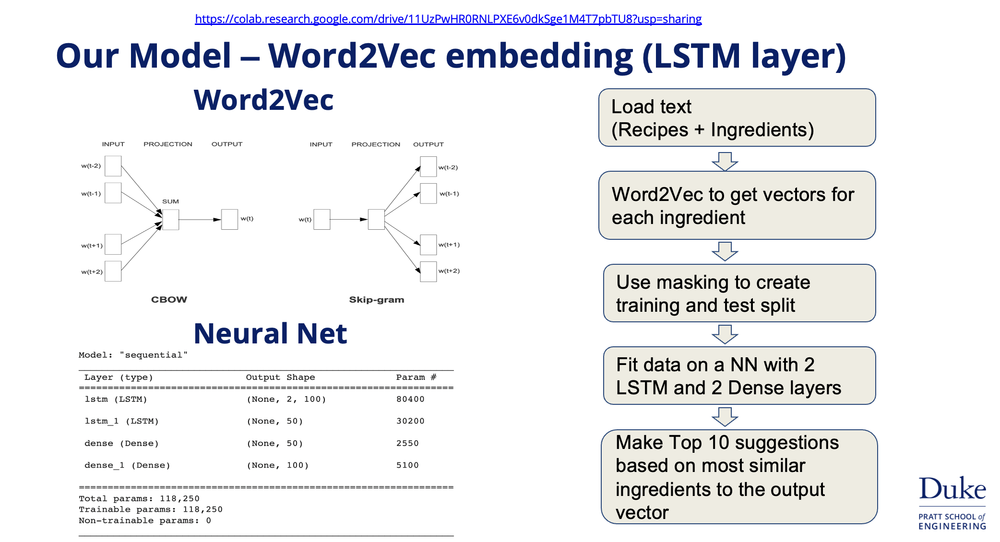
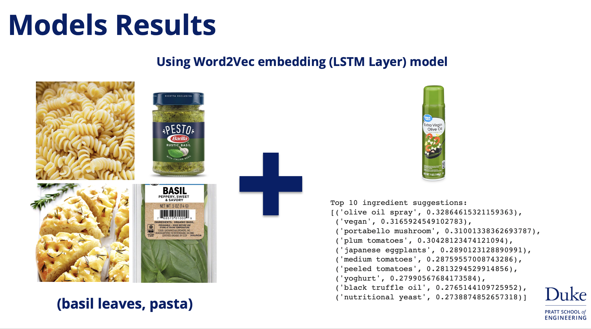
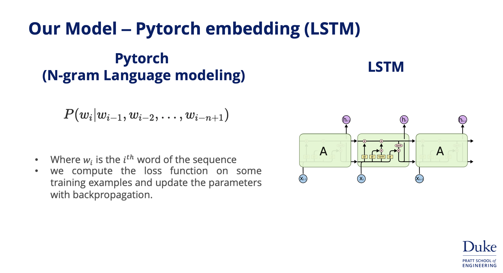

# NLP-ingredient-reccomender

**Project by Bhargav Shetgaonkar, Nikhil Bhargava and Haoran Cai for Duke AIPI 540 Module 2**
<p align="center"></p>

<a name="proj-stat"></a>
## 1. Problem statement
The objective of this project is to train a deep learning model to recommend complementary ingredients to exist ones using NLP

<a name="proj-struc"></a>
## 2. Project Structure
The project data and codes are arranged in the following manner:

```
├── README.md               <- description of the project and how to set up and run it
├── requirements.txt        <- requirements file to document dependencies
├── Makefile [OPTIONAL]     <- set up and run project from the command line
├── main.ipynb             <- contains the main notebook modeled using Word2Vec and LSTM based approach
├── notebooks               <- contains Pytorch Embeddings + LSTM and Doc2Vec approach
├── .gitignore              <- git ignore file
```

_Data_: <br>
the `data` folder is not a part of this git project as it was heavy. The same can be downloaded from below link:
1) Download data [here](https://github.com/schmidtdominik/RecipeNet/raw/master/simplified-recipes-1M.npz) 
    - **Training data:** Reference Link above you can set a validation split while training
    -  **Validation data:** you can set a 0.15 validation split while training
2) Download trained models [here](https://duke.box.com/s/u448hisvoewt7do5z7qyrsdt9llydte1)

```sh
https://github.com/schmidtdominik/RecipeNet/raw/master/simplified-recipes-1M.npz
```

<a name="exp"></a>
## 3. Experimentation
We tried 3 approaches here:

**Approach 1 (Word2Vec + LSTM):**
The best performing model used Word2vec for vectorization and masking to generate predictors and targets as ingredients or representation vectors in our case. We then fine tune vectors using a Neural net with 4 layers (2 LSTM and 2 Dense Layers). To use, Download the model from above link and place in `models` folder.
<p align="center"></p>
<p align="center"></p>
To get recommendations on a recipe, run the following from the home directory:

```sh
python scripts/word2vec_lstm_pred.py
```

This will prompt a user input in the command line for a recipe (comma-seperated input required) and output the model's top ten ingredient reccomendations.
<p align="center"></p>


**Approach 2 (PyTorch Embeddings + LSTM):**
We create our own embeddings using Pytorch and follow the same process as above. To use, Download the model from above link and place in `models` folder.
<p align="center"></p>
<p align="center"></p>
To get recommendations on a recipe, run the following from the home directory:

```sh
python scripts/pytorch_lstm_pred.py
```

This will prompt a user input in the command line for a recipe (comma-seperated input required) and output the model's top ten ingredient reccomendations.
<p align="center"></p>


<!-- **Approach 3(With Inception V3):**
The model is trained with Incpetion V3. The training accuracy with InceptionV3 is 93.57% and test accuracy is 84.59%
<p align="center"></p> -->

**Approach 3 (Doc2Vec):**
Another approach for ingredient recommendations was using doc2vec for recipe vectorization and returning the most similar ingredients based on cosine similarity. This model allows for any sized recipe to be input and will output ten additional ingredient reccomendations. An example of how the approach works can be seen in the image below:


To build the doc2vec model, run the following in the command line from the home directory:

```sh
python scripts/doc2vec_build.py
```
This will output a pickled model under `models/doc2vec_model`. Additionally, will output ingredient document vectors in a csv for ingredient recommendations later under `data/outputs/ingredient_doc2vec.csv`. To skip this step, download from the repo Box linked above and place in `models` folder and the relevant csv to the `data/outputs` directory.

To get recommendations on a recipe, run the following from the home directory:

```sh
python scripts/doc2vec_pred.py
```

This will prompt a user input in the command line for a recipe (comma-seperated input required) and output the model's top ten ingredient reccomendations. A demo of this can be seen below, where the model recommends additional ingredients to add for a "Zavioli with Spinach and Ricotta" recipe:


